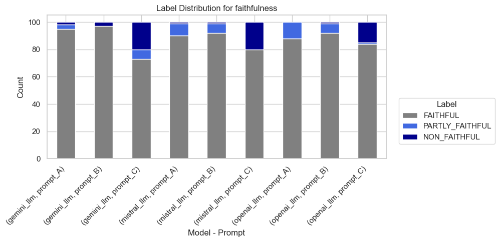

# Kraków Travel Assistant (RAG demo)

<p align="center">
  
</p>

Small Retrieval-Augmented-Generation (RAG) demo that serves Points-Of-Interest (POI) recommendations for Kraków.

This project was implemented for 
[LLM Zoomcamp](https://github.com/DataTalksClub/llm-zoomcamp) -
a free course about LLMs and RAG.

## Project overview

Kraków Travel Assistant is a small Retrieval-Augmented-Generation (RAG) application that helps users explore points-of-interest (POIs) in Kraków, Poland.

Main use cases
- Answer user queries about attractions, opening hours, transport, and short travel tips.
- Collect user feedback on answers to improve monitoring and quality.
- Provide admin monitoring for conversation and feedback metrics.

Key components
- Streamlit UI: travel_assistant/app.py — Q&A Assistant and Monitoring pages.
- RAG backend: travel_assistant/rag.py — prompt construction, hybrid retrieval from Qdrant, and LLM calls (Google Gemini 2.5 Flash Lite via google.generativeai and gpt-4o-mini via OpenAI).
- Ingestion: travel_assistant/ingest.py — reads data/krakow_pois_selected.csv and creates/updates the Qdrant collection hybrid_search.
- Optional storage: Postgres (via docker-compose) for persisting conversations and feedback (helpers in travel_assistant/db.py and persistence.py).

# Quick start 

## Preparation

1. Clone repo and open project root.

2. Environment variables

- Create a `.env` from `.env_template` and set:
  - `GEMINI_API_KEY` — required for Google Gemini via `google.generativeai`.
  - `OPENAI_API_KEY` — optional (used as a judge in some flows).
  - `MISTRAL_API_KEY` — optional for notebooks.
- On Windows (PowerShell): `copy .env_template .env` then edit `.env`.
 
3. **Python** (**3.13.4**) environment
- Pipenv:
  - pip install pipenv

## Running the application

### Running with Docker-Compose

The easiest way to run the application is with `docker-compose`:

```bash
docker-compose up
```

How it should looks if everything is correct [`docker-compose up`](images/docker_compose_up.png):

Open 'http://localhost:8501/' in your browser and enojoy application 😄

To stop the `app`:

```bash
docker-compose stop app
```

or remove it from Docker by hand :) 

### Running locally

If you want to run the application locally,
start only postgres and qdrant:

```bash
docker-compose up postgres qdrant
```

Now run the app on your host machine:

```bash
pipenv shell

streamlit run travel_assistant/app.py
```
or 

use `Run` in `Visual Studio Code`

####
Check if database is set correctly via running (only if `docker compose` up or `docker-compose up postgres qdrant` were used) :
```bash
pipenv shell

python .\travel_assistant\check_db.py
```

You should get info about Tables in database (converstion and feedback).

<p align="center">
  
</p>

## Using the application

There are two pages in app:

- Q&A Assistant: ask questions about Kraków POIs, see conversation history, and provide feedback.
- Monitoring: admin page showing conversation/feedback stats, token usage, and LLM quality metrics.


### Q&A Assistant
<p align="center">
  
</p>

Where user could write question and get answear. User will see conversation history and could add feedback for each answear. User will see his/her feedback stats.

### Monitoring
<p align="center">
  
</p>

To login in use `admin` and `password` or change in   [`travel_assistant/auth.py`](travel_assistant/auth.py).

Here are monitoring statistic like:
* token usage
* costs
* LLM quality (faithfulness, groundedness, relevance, completeness, coherence, conciseness)
* User feedback sumarization

You could add tp database test cases (really poor:P) from [data/answer_data.json](travel_assistant/data/answer_data.json), [data/feedback_data.json](travel_assistant/data/feedback_data.json)

## Code

The code for the application is in the travel_assistant folder:

- [travel_assistant/app.py](travel_assistant/app.py) — Streamlit UI (Q&A Assistant & Monitoring).
- [travel_assistant/rag.py](travel_assistant/rag.py) — RAG backend: prompt building, hybrid retrieval via Qdrant, and Gemini LLM calls.
- [travel_assistant/ingest.py](travel_assistant/ingest.py) — Ingestion script: reads `data/krakow_pois_selected.csv` and creates/updates the Qdrant collection `hybrid_search`.
- [travel_assistant/auth.py](travel_assistant/auth.py) — Simple auth used by the Monitoring page.
- [travel_assistant/check_db.py](travel_assistant/check_db.py) — Helper to verify Postgres tables (conversations, feedback).
- [travel_assistant/db_prep.py](travel_assistant/db_prep.py) — DB preparation utilities.
- [travel_assistant/db.py](travel_assistant/db.py) — Database helpers used by the app and monitoring.
- [travel_assistant/persistence.py](travel_assistant/persistence.py) — Persistence layer for conversations and feedback.
- [travel_assistant/monitoring.py](travel_assistant/monitoring.py) — Monitoring page logic and stats.
- [travel_assistant/ui.py](travel_assistant/ui.py) — UI helper components for Streamlit.
- data file: [data/krakow_pois_selected.csv](travel_assistant/data/krakow_pois_selected.csv)

## Experiments

// ...existing code...

## Notebooks

When running notebooks you need to run qdrant loaclly:
```bash
docker run -p 6333:6333 -p 6334:6334 -v "${PWD}\qdrant_storage:/qdrant/storage" qdrant/qdrant
```

The `notebooks/` directory contains Jupyter notebooks used for data preparation, indexing, and evaluation:

- `[00_prepare_dataset.ipynb](notebooks/00_prepare_dataset.csv)` - Initial data preparation notebook that processes raw POI data and adds Wikipedia summaries
-`[01_indexing_data.ipynb](notebooks/01_indexing_data.csv)` - Demonstrates vector indexing approaches and Qdrant collection setup
- `[02_generating_ground_truth_data.ipynb](notebooks/02_generating_ground_truth_data.csv)`- Creates ground truth data for evaluating retrieval quality (as there were too many POIs I decide to reduce it)
- `[03_evaluating_retrieval.ipynb](notebooks/03_evaluating_retrieval.csv)`- Evaluates different retrieval methods (sparse, dense, hybrid) using ground truth
- `[04_RAG_evaluation.ipynb](notebooks/04_RAG_evaluation.csv)`  - End-to-end RAG system evaluation including relevance and answer quality metrics

These notebooks provide transparency into the data preparation process and system evaluation methodology. They can be run sequentially to reproduce the full data pipeline.

### Evaluating retrieval
The table below compares the performance of several search strategies across four key metrics: Hit Rate, MRR (Mean Reciprocal Rank), Recall@K, and NDCG (Normalized Discounted Cumulative Gain).

| Function                | Hit Rate | MRR     | Recall@K | NDCG    |
|--------------------------|----------|----------|-----------|---------|
| minsearch_metrics        | 0.6985   | 0.5427   | 0.4611    | 0.5803  |
| vector_search_tfidf_svd  | 0.4346   | 0.3216   | 0.2528    | 0.3499  |
| qdrant_vector_search     | 0.6942   | 0.6223   | 0.5740    | 0.6404  |
| multi_stage_search       | 0.6112   | 0.6112   | 0.6112    | 0.6112  |
| **rrf_search**           | **0.7917** | **0.6913** | **0.6287** | **0.7161** |

Key Insights

**rrf_search** delivers the best performance across all metrics, indicating it is the most effective retrieval strategy in this comparison.

qdrant_vector_search performs strongly, especially in recall and ranking quality, making it a solid alternative.

multi_stage_search provides balanced but moderate results across metrics — potentially a good choice when simplicity and stability are prioritized.

vector_search_tfidf_svd shows the weakest performance, suggesting that simple TF-IDF + SVD embeddings may not capture semantic relationships effectively for this task.

**RRF search** is a method for combining results from multiple retrieval runs (rankers) into a single ranking, based on the rank positions rather than raw scores. The core idea: if a document appears high in several rank-lists, it should get a higher final rank.

### RAG evaluation
Testing multiple models (`gemini-2.5-flash-lite`, `mistral-large-latest` (open-source), and `gpt-4o-mini`) and prompts (`A`, `B`, and `C`) helps identify the most robust and consistent approach by comparing how different models handle diverse queries and how prompt phrasing affects their responses.

The score is a composite metric that considers Faithfulness, Groundedness, Relevance, Completeness, Coherence, and Conciseness to provide an overall assessment of response quality (max score 6).

I tested only 100 samples to avoid paying for the models 😄. The data is available in [data/experiments_output](data/experiments_output).

| Model        | Prompt   | Count | Mean  | Std Dev  | Min | 25%  | 50% | 75% | Max |
|---------------|----------|-------|-------|----------|-----|------|-----|-----|-----|
| **gemini_llm**  | prompt_A | 100 | **5.02** | 1.0916 | 2.0 | 4.00 | 5.0 | 6.0 | 6.0 |
|               | prompt_B | 100 | **5.16** | 0.9819 | 3.0 | 4.00 | 6.0 | 6.0 | 6.0 |
|               | prompt_C | 100 | 4.62 | 1.2695 | 2.0 | 3.75 | 5.0 | 6.0 | 6.0 |
| **mistral_llm** | prompt_A | 100 | 4.58 | 1.0841 | 0.0 | 4.75 | 5.0 | 5.0 | 6.0 |
|               | prompt_B | 100 | 4.62 | 1.0615 | 0.0 | 5.00 | 5.0 | 5.0 | 6.0 |
|               | prompt_C | 100 | 4.86 | 1.3028 | 0.0 | 4.00 | 5.0 | 6.0 | 6.0 |
| **openai_llm**  | prompt_A | 100 | 4.66 | 1.3425 | 2.0 | 4.00 | 5.0 | 6.0 | 6.0 |
|               | prompt_B | 100 | 4.93 | 1.2412 | 2.0 | 4.00 | 5.0 | 6.0 | 6.0 |
|               | prompt_C | 100 | **4.93** | 1.1913 | 3.0 | 4.00 | 6.0 | 6.0 | 6.0 |

Based on the average mean scores across all prompts, Gemini LLM demonstrates the best overall performance, achieving the highest mean values for Prompt A and Prompt B, and competitive results on Prompt C. OpenAI LLM follows closely, performing best on Prompt C, while Mistral LLM shows consistent but slightly lower scores across all prompts. Overall, `**gemini-2.5-flash-lite**` provides the most balanced and robust performance, particularly with `**Prompt B**`, and** was selected for use in the Travel Assistant application**.

#### Evaluation Metrics

To assess the quality of model-generated responses, we use six key metrics that capture different dimensions of answer quality and reliability:

`Faithfulness` — Measures how accurately the response reflects the information in the provided context, without introducing unsupported or fabricated details.

`Groundedness` — Evaluates whether the model’s claims are backed by evidence from the source material or reference data.

`Relevance` — Assesses how well the response stays on-topic and addresses the user’s query directly.

`Completeness` — Checks whether the response includes all necessary information and fully answers the question without omissions.

`Coherence` — Examines the logical flow, structure, and readability of the response, ensuring it is easy to follow and internally consistent.

`Conciseness` — Measures the efficiency of the response, ensuring it is clear and informative without unnecessary repetition or verbosity.

Together, these metrics provide a comprehensive view of both the factual accuracy and communicative quality of model outputs, supporting a balanced evaluation across truthfulness, coverage, and clarity.

All metrics are visualized in the [images](images) folder. As an example, the distributions for Faithfulness and Groundedness are shown below:

<p align="left">  </p> <p align="right">  </p>

You can explore the rest of the metric distributions in the images folder.

## Last Words

That was a really interesting and fun learning experience, but as usual, I ended up spending most of the time just getting the data ready 😆
